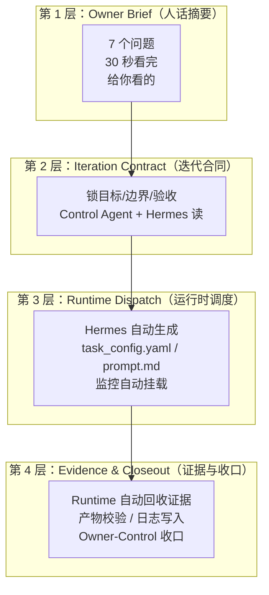
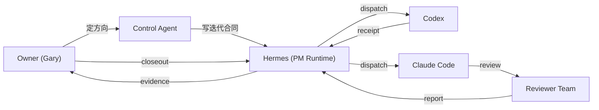
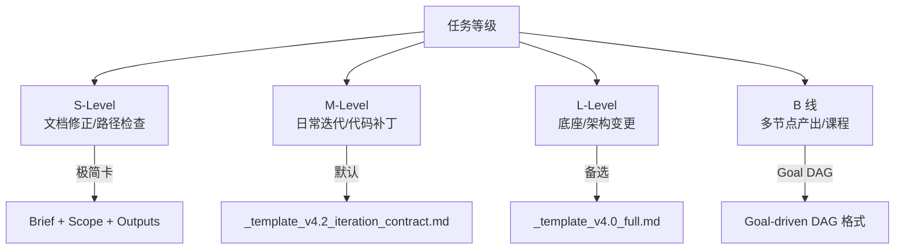
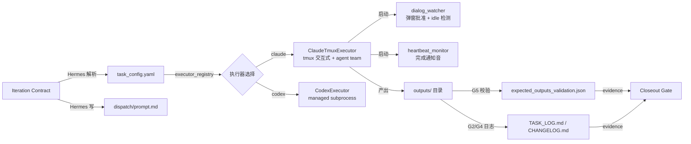
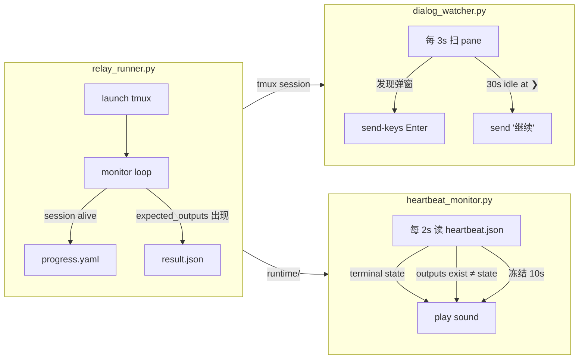
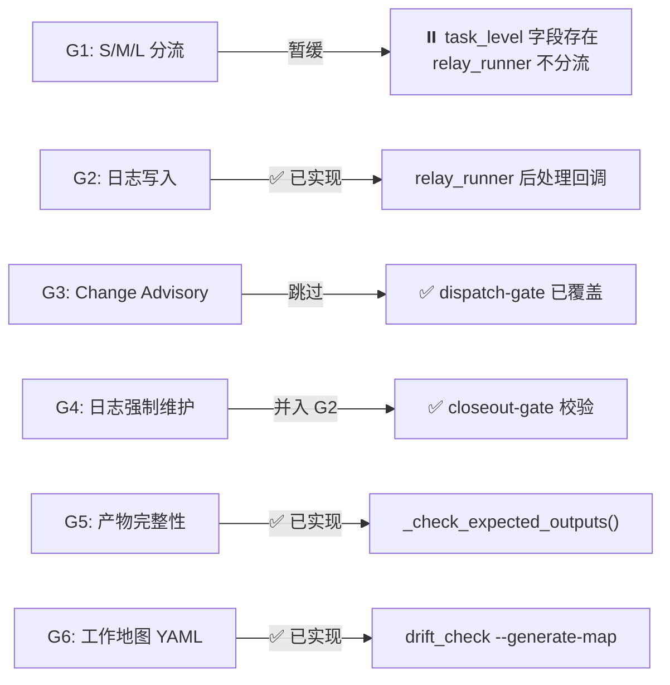
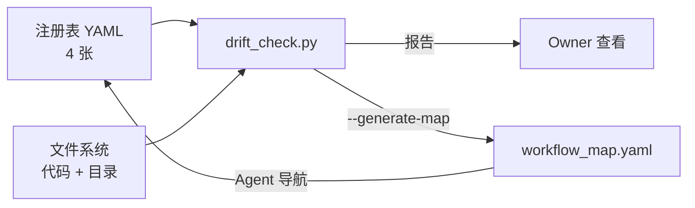
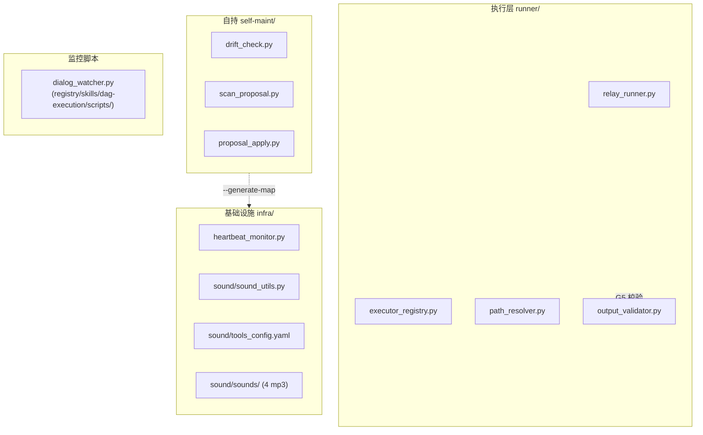
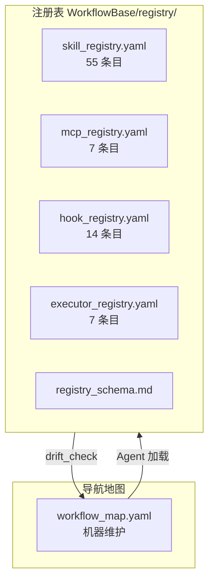
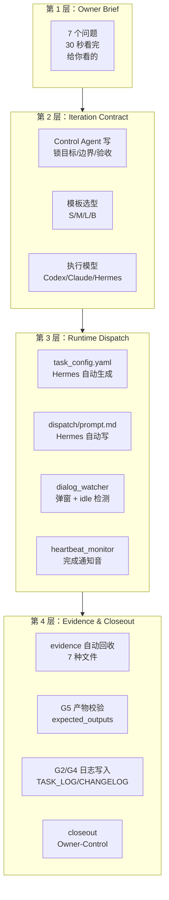

# OpenNOVA EvalHarnessSystem — 工作流 v4.3 现状描述

> 当前范围：§0–§14
> 状态：draft / 基于 v4.2 Reality Review + G1-G6 实现 + Control Agent 决策
> 生成日期：2026-06-04

---

# §0 文档定位与权威源

本文是 OpenNOVA EvalHarnessSystem工作流的现状描述文件。

## 0.1 权威源层级

```text
1. WorkflowBase/ 下的注册表 + 代码 = 真实权威
2. 本文 = 现状描述 + 架构决策记录，不是 design intent
3. docs/design/ 下 v4.0 及之前的旧设计文档已被确认过时
```

## 0.2 本文回答三个问题

```text
1. 现在的工作流长什么样？
2. 有哪些主要角色和模块？
3. 有哪些能力？
```

---

# §1 v4.3 核心目标

v4.3 不是新设计，而是基于 Reality Review + G1-G6 实现后的现状基线和架构决策记录。

## 1.1 核心模型：四层工作流

```text
旧工作流（隐式的、靠口头传的）：
Owner 说需求 → Hermes 找人执行 → 执行完告诉 Owner → Owner 判断

现在的工作流（四层显式化）：
第 1 层：Owner Brief    ← 人话摘要，30 秒看完
第 2 层：Iteration Contract  ← Control Agent + Hermes 读
第 3 层：Runtime Dispatch     ← Hermes 自动生成
第 4 层：Evidence & Closeout  ← Runtime 自动回收 + Owner 收口
```



## 1.2 v4.3 的关键变化

相对于 v4.0 时期（以设计文档为准）：

| 变化 | v4.0 时期 | v4.3 现状 |
|------|-----------|----------|
| 权威源 | workflow_core_v4.0_r2.md（197KB 设计文档） | WorkflowBase/ 注册表 + 代码 |
| 模板 | 无统一模板，多版本混用 | v4.2 iteration contract + 选型规则 |
| 执行器 | Codex 被绑死写日志 | relay_runner 后处理回调，不绑 executor |
| 监控 | 无自动 idle 检测 | dialog_watcher 30s 自动推 |
| 证据链 | 无 expected_outputs 校验 | G5 产物完整性检查 |
| 日志 | 人工写 TASK_LOG | G2/G4 自动 append |
| 工作地图 | compact YAML 设计未实现 | workflow_map.yaml 已由 --generate-map 生成 |
| 声音 | 固定 | public/private profile 切换 |
| 工具链 | 部分在 B 线 workyb/ | 全部迁入 A 线自包含 |

---

# §2 核心原则

A 线工作流目前基于 8 条核心原则运行。

## 2.1 原则列表

```text
1. 人先看 Owner Brief，机器再读 Contract。
2. Codex 默认单节点，Claude workflow 才默认 DAG。
3. Hermes 永远是 PM Runtime，不让工人当工头。
4. Iteration Plan 只锁目标、边界、验收，不写成 Runtime 说明书。
5. Dispatch / task_config 由 Hermes 从合同生成，不让你手写。
6. Evidence 是硬门：没有 expected_outputs / receipt / result，就不算完成。
7. Closeout 只能 Owner-Control 做，PM summary 不等于 closeout。
8. B 线能力通过 promotion 进入 A 线，不再无限停在实验场。
```

## 2.2 原则详解

### 原则 1：人先看 Owner Brief，机器再读 Contract

Owner Brief 是放在迭代计划顶部的 7 个问题。这是唯一写给 Owner 看的部分。看完 Owner Brief 你就能决定"这轮值不值得做"、"要不要批"。

Contract 写给 Control Agent + Hermes。Control Agent 用它做调度决策，Hermes 用它生成 dispatch。Owner 不需要读 Contract 全文。

### 原则 2：Codex 默认单节点，Claude 才默认 DAG

Codex 是高约束工程执行器，适合改一个模块、补一个 validator、修一个 registry。不默认 agent team，不默认多节点 DAG。

Claude Code workflow 适合多文件盘点、Reality Review、并行审查、课程作业。需要多节点编排时才走 DAG。

```text
Codex = 稳定施工队
Claude workflow = 灵活项目组
Hermes = 工头
```

### 原则 3：Hermes 永远是 PM Runtime，不让工人当工头

Hermes 负责调度、派发、回收、监控。不写业务代码，不做 closeout。Codex 和 Claude Code 是被 Hermes 调度的 worker。

### 原则 4：Iteration Plan 只锁目标、边界、验收

迭代计划回答：做什么、不做什么、做完怎么看。不写成 Runtime 说明书。Runtime 细节（task_config、dispatch 路径、prompt 格式）由 Hermes 从合同自动生成。

### 原则 5：Dispatch 由 Hermes 从合同生成

Control Agent 写好 Iteration Contract 后，Hermes 自动填充 task_config.yaml、选择 executor、生成 dispatch/prompt.md。Owner 不需要手写任何 dispatch 配置。

### 原则 6：Evidence 是硬门

没有 expected_outputs → 没有 receipt → 没有 result → 不算完成。G5 实现确保 relay_runner 收尾时自动校验。

### 原则 7：Closeout 只能 Owner-Control 做

PM Runtime 可以写 summary，但 summary 不等于 closeout。closeout 必须由 Owner 明确决策，走 `task-status-writer.py` 校验。

### 原则 8：B 线能力通过 promotion 进入 A 线

B 线（workyb）是实验场。成熟能力通过 B→A promotion gate 进入 A 线，不长期停在实验场。

---

# §3 角色分工

## 3.1 角色总览



## 3.2 Owner (Gary)

Owner 是项目方向与最终审批权威。

**负责：**

```text
1. 提出项目目标或版本需求；
2. 判断是否接受 Control Agent 的推进方案；
3. 审阅 dispatch-approval-gate 确认派发；
4. 审阅关键文档和 closeout 判断；
5. 对方向、边界、节奏作最终决策。
```

**不负责：**

```text
1. 人工复制长任务书给每个 Agent；
2. 人工轮询长任务进度；
3. 人工整理执行器产物路径。
```

**批准规则：**

```text
以下情况不得视为批准：
1. Owner 沉默；
2. Owner 超时未回复；
3. Owner 模糊表达；
4. 历史偏好；
5. PM Runtime 自行判断"应该可以"；
6. DS pass 不等于 Owner 批准；
7. Codex delivered 不等于 Owner 批准。
```

## 3.3 Control Agent

Control Agent 是调度层决策者。

**负责：**

```text
1. 定 scope：做什么、不做什么；
2. 选模板：S/M/L/B 四档；
3. 选执行器：Codex / Claude Code / 混合；
4. 选执行模式：single_node / agent_team / workflow_dag；
5. 写 Owner Brief。
```

**不负责：**

```text
1. 不替 Hermes 写 dispatch（task_config、prompt）；
2. 不替 Owner 做 closeout。
```

## 3.4 Hermes / PM Runtime

Hermes 是调度和执行中台。

**负责：**

```text
1. 根据 Iteration Contract 生成 task_config.yaml；
2. 通过 executor_registry 选择执行器；
3. 执行 relay dispatch（init → launch → monitor → collect）；
4. 启动 dialog_watcher + heartbeat_monitor；
5. 回收 evidence（result.json、receipt、pane_capture）；
6. 写 PM Runtime summary（不等于 closeout）；
7. 触发 G5 产物校验 + G2/G4 日志写入。
```

**不负责：**

```text
1. 不写业务代码；
2. 不做 closeout 决策；
3. 不替 Owner 做方向判断；
4. 不以"看起来不对"杀掉正在跑的 session。
```

## 3.5 Codex

Codex 是高约束工程执行器。

**负责：**

```text
1. 按 iteration contract 执行单模块改动；
2. 写测试、跑测试；
3. 输出 receipt / result；
4. 按授权在允许路径内落盘。
```

**不负责：**

```text
1. 不自行决定范围；
2. 不默认 agent team；
3. 不默认多节点 DAG；
4. 不自行 closeout。
```

## 3.6 Claude Code

Claude Code 是灵活执行器，支持 agent team + workflow DAG。

**适用场景：**

```text
1. Reality Review（workflow-reality-review / code-reality-review）；
2. 多文件盘点；
3. 并行审查（Reviewer Team）；
4. 课程作业 / demo pipeline；
5. 复杂迁移前对账。
```

## 3.7 Reviewer Team

并行审查团队（原 DS Team），负责事实核查。

**负责：**

```text
1. 结构完整性检查；
2. 能力真实性验证；
3. 一致性审查；
4. 边界与风险评估；
5. 合成审查报告。
```

**不负责：**

```text
1. 不替 Control Agent 做决策；
2. 不替 Owner 做 closeout。
```

---

# §4 第一层：Owner Brief

## 4.1 定位

Owner Brief 是放在每次迭代计划顶部的 7 问题摘要。**写给 Owner 看**。30 秒能读完。

Control Agent 在写完迭代合同后填写 Owner Brief。它不包含 YAML、不包含技术细节、不包含调度配置。只有 Owner 需要知道的信息。

## 4.2 7 个问题

```text
1. 这轮干嘛？
   一句话目标。如"给 relay_runner 加一个收尾产物校验"。

2. 为什么现在做？
   触发原因。如"G5 是 Control Agent 判定 Go2 前必须修的唯一缺口"。

3. 谁调度？谁执行？
   如"调度：Hermes；执行：Codex（单节点）"。

4. 单节点还是多节点？
   single_node / workflow_dag。单节点不改其他模块，多节点需多个 executor。

5. 会碰哪些文件？
   核心改动列表，3-5 个。不说全部，只说关键的。

6. 做完我看什么？
   验收产物。如"语法检查通过 + expected_outputs_validation.json 生成"。

7. 什么情况必须停？
   如"改了 contract 之外的文件"、"expected_outputs 检查阻塞了正常流程"。
```

## 4.3 格式要求

```markdown
## 第 1 层：Owner Brief（人话摘要）

**1. 这轮干嘛？**
_{一句话}_

**2. 为什么现在做？**
_{理由}_

...（7 个问题）
```

Owner Brief 放在迭代合同顶部，`## 第 1 层：Owner Brief` 标题下，清晰分隔。

---

# §5 第二层：Iteration Contract

## 5.1 定位

迭代合同锁死目标、边界、验收。给 Control Agent + Hermes 读。Owner 只需要看 Owner Brief。

合同由 Control Agent 在启动新迭代时填写，基于 `_template_v4.2_iteration_contract.md`。

## 5.2 合同结构

```text
0. Record Protocol（记录协议）
   skill_loaded / record_type / blocker_status

1. Version Info（版本信息）
   版本号 / 基于版本 / 日期 / 状态

2. Control Agent Decision（调度决策）
   control_agent / owner_approval_required / task_level

3. Goal & Boundary（目标与边界）
   goal / allowed_paths / forbidden_files

4. Review / Audit（审查范围）
   reviewer_team / review_type / review_outputs

5. File Change Scope（文件改动范围）
   expected_new_files / modified_files / deleted_files / unchanged_files

6. Execution Strategy（执行策略）
   orchestrator / execution_shape / primary_executor / observer_mode

7. Verification Plan（验证方案）
   expected_outputs / artifact_validation / capture_stdout

8. Runtime Evidence Requirement（运行时证据要求）
   receipt / result / logs

9. Acceptance & Closeout（验收与收口）
   acceptance_criteria / closeout_record

10. Notes / Carry-over（备注与遗留项）
    minor issues / future backlog
```

## 5.3 字段详解

### Record Protocol

```yaml
skill_loaded: 加载本模板时加载的 skill 名称
record_type: iteration_plan
blocker_status: none | present | not_checked
artifact_quality: pass | fail | not_checked
closeout_eligible: false
```

### Execution Strategy

| 字段 | 值 | 说明 |
|------|-----|------|
| execution_shape | single_node / agent_team / workflow_dag | 默认 single_node |
| primary_executor | Codex / Claude Code | Codex 默认单节点 |
| observer_mode | true / false | 弹 Terminal 窗口 |
| dag_nodes | [] | 仅多目标时填写 |

### Verification Plan

```yaml
expected_outputs:
  - outputs/<文件>    # relay_runner 据此做 G5 产物检查
artifact_validation: true
capture_stdout: true
capture_pane: true
heartbeat_monitor: true
```

---

# §6 模板选型与执行模型

## 6.1 模板选型



| 等级 | 适用场景 | 模板 | 审查 | closeout profile |
|------|---------|------|------|-----------------|
| **S** | 文档修正、路径检查、单点审查 | 极简卡 | 不需要 | smoke |
| **M** | 日常迭代、代码补丁、registry 小修 | v4.2 contract | 可选 | standard |
| **L** | WorkflowBase、PM Runtime、跨系统 | v4.0 full | 前置审查 | full_dag |
| **B 线** | 多节点产出、课程作业、demo | Goal-driven DAG | — | — |

## 6.2 执行模型

```text
Codex = single_node（默认），高约束工程落盘
Claude Code = agent_team（审查）或 workflow_dag（多目标编排）
Hermes = PM Runtime，不直接执行
```

### Codex 默认 single_node

```text
Codex 不默认 agent team，不默认多节点 DAG。
适合：
- 改一个模块；
- 补一个 validator；
- 修一个 registry；
- 写一个 hook；
- 做一次受控落盘。
```

### Claude Code 什么时候用 agent_team / workflow_dag

```text
Claude Code agent team = 并行审查
适合：Reality Review、code review、registry review

Claude Code workflow = 多目标 / 多节点 / 快速编排
适合：多文件盘点、课程作业、demo pipeline、复杂迁移前对账
```

---

# §7 第三层：Runtime Dispatch

## 7.1 执行管道

Hermes 根据 Iteration Contract 自动生成 dispatch，不让你手写。



## 7.2 task_config.yaml 格式

```yaml
task_id: <唯一标识>
task_title: <人类可读标题>
task_domain: review | dogfood | smoke | inventory | demo
executor_type: claude | codex
execution_mode: tmux_interactive | managed_subprocess
observer_mode: true
observer_attach: terminal_window
executor_options:
  prompt_file: dispatch/prompt.md   # 相对 task_dir
  workflow: true | false            # 仅 claude 需要
  agent_team_size: 5                # 仅 agent team 需要
  expected_outputs:
    - outputs/<文件>
paths:
  task_dir: tasks/active/<task_id>/
  runtime_dir: tasks/active/<task_id>/runtime
  output_dir: tasks/active/<task_id>/outputs
```

## 7.3 禁止设置

**不写 `runtime_control` 节。** executor 不设静态 timeout，只根据：
- session 存活
- heartbeat 更新
- 产物出现
- 完成标记

判断完成。所有静态 timeout 值（`no_output_timeout_sec`、`emergency_max_wall_time_sec`）已从 monitor loop 中移除。

## 7.4 监控管道



---

# §8 监控系统

## 8.1 Dialog Watcher

`dialog_watcher.py` 是 dispatch 后立即启动的 tmux 会话监视器。它有两个功能。

### 功能 1：权限弹窗自动批准

| 弹窗类型 | 检测关键词 | 处理 |
|----------|-----------|------|
| BASH 权限弹窗 | "Do you want to proceed?" | 自动 Enter（选 Yes） |
| 文件创建 | "Do you want to create" | 自动 Enter |
| 文件覆盖 | "Do you want to overwrite" | 自动 Enter |
| 编辑确认 | "Do you want to make this edit" | 自动 Enter |
| Workflow auto-mode | "switch to auto mode" | 不自动批，通知 Owner |

### 功能 2：Idle-at-prompt 检测（2026-06-04 新增）

```text
每 3 秒扫描 tmux pane。
如果 Claude 停在 ❯ prompt 且 expected_outputs 不存在：
  → 等 30 秒
  → 仍然没动 → 自动发"继续"推它
  → 60 秒冷却，避免刷屏
```

### 启动方式

```bash
python3 WorkflowBase/registry/skills/dag-execution/scripts/dialog_watcher.py \
  <tmux-session-id> <task-dir>
```

**已知陷阱：** 第一个参数是 **tmux session 名称**（如 `adarian_workflowbase-v4_2-reality-review`），不是 task 目录路径。

## 8.2 Heartbeat Monitor

`heartbeat_monitor.py` 是独立于 relay runner 的完成检测和通知守护进程。

### 检测信号

| # | 信号 | 说明 |
|---|------|------|
| 1 | runtime_state ∈ {executor_completed, executor_failed, hold, timeout, error, session_lost} | 正常完成/失败，立即播声音 |
| 2 | outputs/ 有文件但 heartbeat 仍说 running | artifact detector 盲区兜底 |
| 3 | 心跳冻结 >10s | 先查 outputs/ → 有文件播完成音，没文件播崩溃音 |

### 启动方式

```bash
python3 WorkflowBase/infra/heartbeat_monitor.py <task-dir>
```

## 8.3 声音 Profile

```yaml
# WorkflowBase/infra/sound/tools_config.yaml
profile: public    # 工位/图书馆 → Glass 系统音（安全、不社死）
profile: private   # 在家 → 自定义梗音

profiles:
  public:
    heartbeat_sound: "Glass"
    auto_mode_sound: "Glass"
    crash_sound: "Glass"
  private:
    heartbeat_sound: "mission_complete.mp3"
    auto_mode_sound: "movie_start.mp3"
    crash_sound: "wasted.mp3"
```

---

# §9 第四层：Evidence & Closeout

## 9.1 证据链

每次 relay dispatch 执行完成后自动回收以下文件：

| 证据 | 路径 | 用途 |
|------|------|------|
| receipt | outputs/<executor>_receipt.yaml | 执行回执 |
| result | runtime/result.json | 运行结果 |
| failure_classification | runtime/failure_classification.yaml | 失败分类 |
| heartbeat | runtime/heartbeat.json | 心跳记录 |
| pane_capture | runtime/pane_capture.log | 完整会话日志 |
| task_state | runtime/task_state.yaml | 状态变迁 |
| expected_outputs | outputs/<文件> | 产物 |

## 9.2 产物完整性检查（G5）

relay_runner 收尾时自动执行 `_check_expected_outputs()`。

```python
def _check_expected_outputs(config) -> dict:
    """读取 executor_options.expected_outputs，逐条检查存在且非空。
    结果写入 outputs/expected_outputs_validation.json。"""
```

检出缺失 → registry event 标记 `artifact_fail`。缺失不阻塞任务完成，但证据链会标记。

**G5 实现位置：** `WorkflowBase/runner/relay_runner.py`（`_check_expected_outputs` 函数）

## 9.3 日志自动写入（G2+G4）

relay_runner 收尾时自动 append：

| 文件 | 内容 | 格式 |
|------|------|------|
| `docs/iterations/TASK_LOG.md` | 任务执行记录 | `## date: task_id` + executor + status |
| `docs/iterations/CHANGELOG.md` | 版本变更记录 | `## date: task_id (executor)` + status |

写入失败不阻塞执行，仅记录 registry event。

**G2/G4 实现位置：** `WorkflowBase/runner/relay_runner.py`（`_append_task_log` 函数）

## 9.4 closeout 规则

```text
1. 只能 Owner-Control 做 closeout；
2. PM Runtime 的 summary 不等于 closeout；
3. closeout-gate 根据 execution_profile 选择档位：
   - smoke → 简单验证
   - standard → 普通执行
   - full_dag → DAG/runtime 底座任务
4. 写 task_status.yaml 必须走 task-status-writer.py 校验；
5. closeout 后任务从 active/ 移入 archived/。
```

**closeout checklist（以 full_dag 为例）：**

```yaml
required:
  - task_status.yaml
  - dispatch/
  - runtime/result.json
  - outputs/execution_report.md
  - receipts/
  - summary/summary.md
  - TASK_LOG_CHANGELOG_updated
```

---

# §10 G1-G6 设计缺口状态（2026-06-04）

## 10.1 状态总览



## 10.2 逐项说明

### G1 — S/M/L/Patch 分流

**现状：** `relay_runner.py:340` 从 task_config 读取 `task_level` 字段，但不据此改变行为，只是透传。closeout-gate 有 3 档 profile（smoke/standard/full_dag）但未与 S/M/L 映射。pre-execution-plan-review skill 已创建（填补了"方案审查"缺口）。

**Decision：** ⏸️ 暂缓。需 Owner 决定"不同等级要不要走不同执行路径"。

### G2 — 日志自动写入

**实现：** `_append_task_log()` 函数。在 `run_task()` 的 executor_completed 分支中调用。自动 append TASK_LOG.md 和 CHANGELOG.md。

**Decision：** ✅ 已实现。不绑在 Codex 上，而是 relay_runner 后处理回调。

### G3 — Change Advisory

**现状：** dispatch-approval-gate 已拦截 dispatch 意图，显示改动范围让 Owner 确认。正式 Change Advisory Board 不需要。

**Decision：** ❌ 跳过。dispatch-approval-gate 已覆盖核心需求。

### G4 — 日志强制维护

**实现：** closeout-gate §2 Full DAG profile 有 `TASK_LOG_CHANGELOG_updated` 条目。G2 自动写入后，此条为确认自动写入成功。

**Decision：** ✅ 已并入 G2。

### G5 — 产物完整性 Validator

**实现：** `_check_expected_outputs()` 函数 + `WorkflowBase/runner/output_validator.py`。校验 expected_outputs 存在且非空。结果写入 `outputs/expected_outputs_validation.json`。

**Decision：** ✅ 已实现。Go2 前必须做的最关键补丁。

### G6 — 机器维护的工作地图 YAML

**实现：** `drift_check.py --generate-map` 模式。运行时生成 `workflow_map.yaml` 到项目根。内容含：workspace 信息、注册表概览（skills/MCPs/hooks/executors）、活跃迭代和归档版本、关键路径。

**Decision：** ✅ 已实现。由 Control Agent 重新定义为"机器维护的 Agent 导航地图"。

---

# §11 防漂移体系

## 11.1 自持循环



## 11.2 Drift Check

位置：`WorkflowBase/self-maint/drift_check.py`

```bash
# 标准检查（P0 + P1）
python3 WorkflowBase/self-maint/drift_check.py

# 深度检查（+ P2：MCP 交叉引用 + README 一致性）
python3 WorkflowBase/self-maint/drift_check.py --deep

# 检查 + 刷新工作地图
python3 WorkflowBase/self-maint/drift_check.py --generate-map
```

**检查维度：**

| 维度 | 检查内容 | 严重性 |
|------|---------|--------|
| schema 合规 | 必填字段、枚举合法性 | warning |
| 跨文件引用 | depends_on 目标是否存在 | critical |
| 路径存在性 | module_path/hook_path 是否可解析 | warning |
| 环境变量 | env_required 是否在 shell 或 config.yaml 中 | info |
| MCP 配置 | 注册的 MCP 是否在 config.yaml 中 | info |
| README 一致性 | 条目计数 vs 实际 | info |
| 文件系统 vs 注册表 | 存在文件但未注册 | info |

**env 检查改进（2026-06-04）：** 不再只检查 `os.environ`。现在也会查 `~/.hermes/config.yaml` 中 MCP 的 env 块。支持 `(handled by ...)` 注释跳过。

## 11.3 Workflow Map（G6）

位置：项目根 `workflow_map.yaml`

由 `drift_check.py --generate-map` 自动生成。Agent 加载后用于了解：

```yaml
workflow_map:
  workspace:
    project: "Adarian MVP"
    version: "v4.0"
    root: "/Users/gary/项目开发/AdarianMigration/adarian mvp"
  registries:
    skills: { total_active: 53, ... }
    mcps: { active: [brave, fetch, github, ...], count: 7 }
    hooks: { auto_trigger: [6], gate_scripts: [5], utility: [2] }
    executors: { entries: [7], has_tmux: true, ... }
  iterations:
    active: []
    archived_versions: ["v1.x"]
    template: "docs/iterations/templates/_template_v4.2_iteration_contract.md"
```

## 11.4 其他防漂移机制

| 机制 | 位置 | 说明 |
|------|------|------|
| path_resolver | `WorkflowBase/runner/path_resolver.py` | 从单 project_root 派生所有路径 |
| iteration-gate | `~/.hermes/scripts/iteration-gate.py` | 自动落盘 Downloads 新计划到 active/ |
| KNOWN_BLIND_SPOTS | `WorkflowBase/self-maint/KNOWN_BLIND_SPOTS.md` | 自维护系统检测不到的盲区 |
| session handoff | `.session_handoff.md`（项目根） | 跨会话上下文接力 |

---

# §12 工具链与注册表体系

## 12.1 A 线自包含工具链

所有工具脚本在 A 线 `WorkflowBase/` 下自包含，不依赖 B 线 workyb 路径。



| 工具 | 位置 | 用途 |
|------|------|------|
| relay_runner | `WorkflowBase/runner/relay_runner.py` | 执行管道：init → launch → monitor → collect |
| executor_registry | `WorkflowBase/runner/executor_registry.py` | 执行器注册和查找 |
| path_resolver | `WorkflowBase/runner/path_resolver.py` | 路径防漂移 |
| drift_check | `WorkflowBase/self-maint/drift_check.py` | 注册表 vs 文件系统一致性检查 |
| heartbeat_monitor | `WorkflowBase/infra/heartbeat_monitor.py` | 完成检测 + 声音通知 |
| dialog_watcher | `registry/skills/dag-execution/scripts/dialog_watcher.py` | 权限弹窗 + idle 检测 |
| sound_utils | `WorkflowBase/infra/sound/sound_utils.py` | 声音解析和播放 |
| tools_config | `WorkflowBase/infra/sound/tools_config.yaml` | 声音 profile 配置 |
| output_validator | `WorkflowBase/runner/output_validator.py` | G5 产物校验 |

## 12.2 注册表体系



| 注册表 | 条目数 | 描述 |
|--------|-------|------|
| `skill_registry.yaml` | 55 | 所有 skill 能力注册（含 Hermes、CC Switch、PM Runtime 等） |
| `mcp_registry.yaml` | 7 | MCP 服务器注册（brave、fetch、time、github、arxiv、paper-search、zhipu） |
| `hook_registry.yaml` | 14 | hook（6） + gate_script（5） + utility（3） |
| `executor_registry.yaml` | 7 | executor（4） + resolver（1） + plugin（2） |
| `workflow_map.yaml` | — | 机器维护的 Agent 导航地图 |

---

# §13 文档结构规范

## 13.1 目录树

```text
docs/
  iterations/
    active/              ← 当前活跃的迭代计划
    archived/v1.x/       ← 已 closeout 的历史迭代（v1.1 ~ v1.2）
    templates/
      _template_v4.2_iteration_contract.md   ← A 线默认模板
      _template_v4.0_full.md                  ← L-Level 备选模板
    TASK_LOG.md          ← 任务执行日志（relay_runner 自动维护）
    CHANGELOG.md         ← 版本变更日志（relay_runner 自动维护）
    README.md            ← 目录说明

  design/
    workflow_core/
      workflow_core_v4.3.md                   ← 本文
      workflow_core_v4.0_r2.md                ← 历史（已确认过时）
    patches/
      v4.0_patch_001_industry_benchmark.md    ← 业界基准调研

  archive/
    templates/           ← 过时模板（_template.md v1/v2/v3）
    iteration-plans/     ← 已 closeout 的旧迭代计划（外部归档）

tasks/
  active/                ← 正在执行的任务
  archived/              ← 已 closeout 的任务（按 domain 分：review / development / workflow 等）

workflow_map.yaml        ← 机器维护的 Agent 导航地图
```

## 13.2 生命周期

```text
起草（~/Downloads/）
  → iteration-gate hook 自动落盘到 active/
  → 执行中（active/）
  → closeout 确认后移入 archived/
  → 台账（TASK_LOG.md / CHANGELOG.md）始终留在根目录
```

---

# §14 四层工作流全貌图


